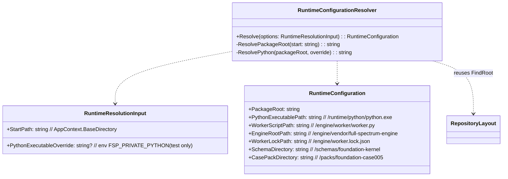
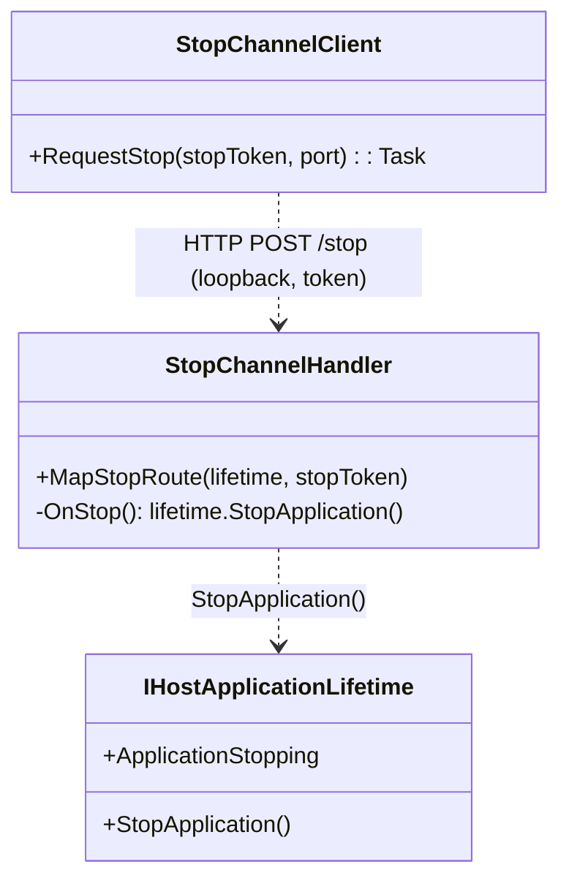
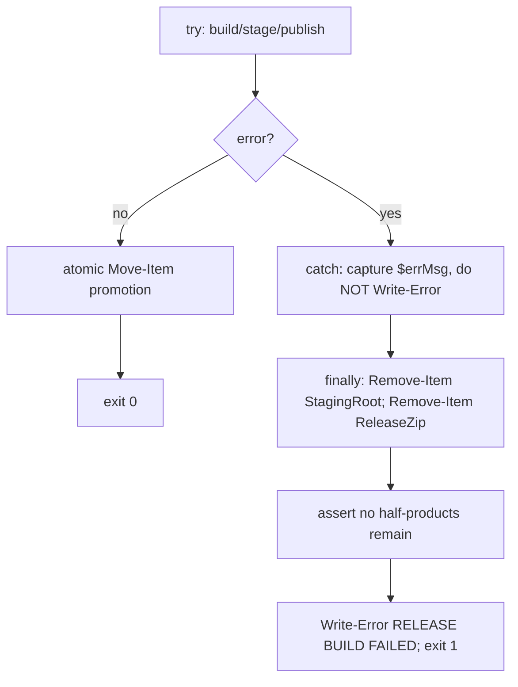
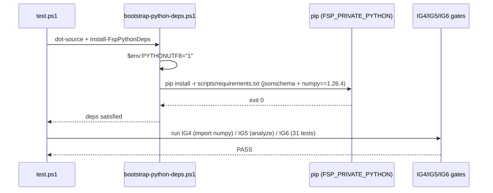
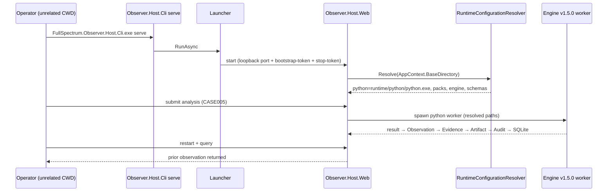
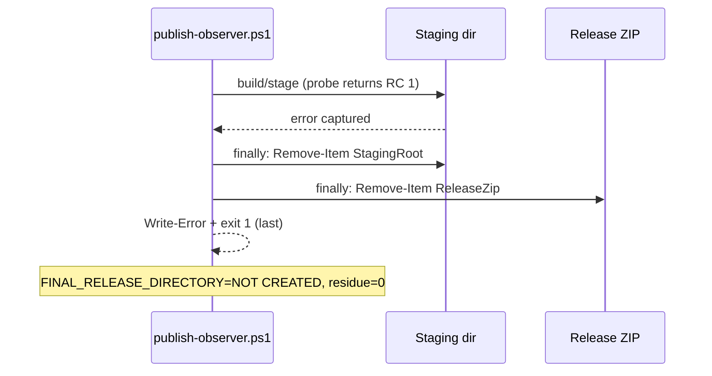
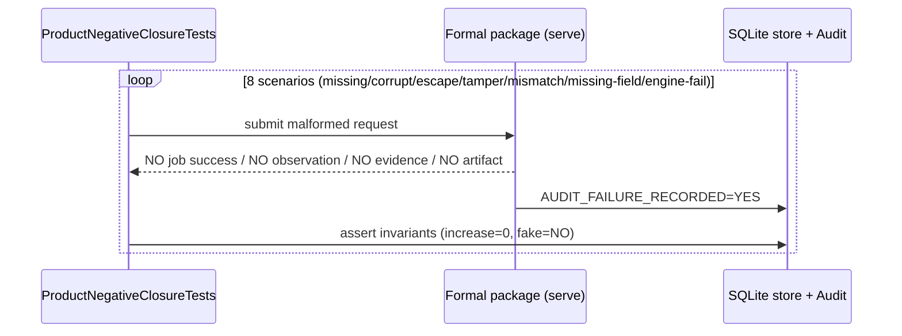
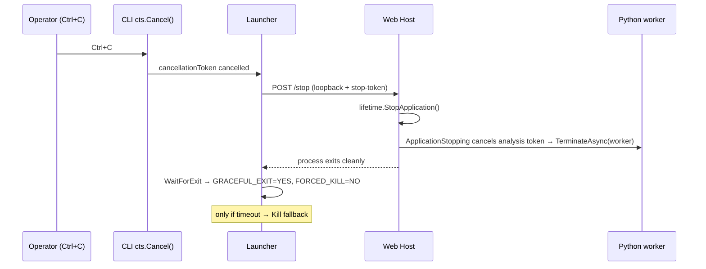

# M2-FIX-03 Incremental Design — Observer v0.3 Release-Closure Narrow Fix

> **Scope discipline (do NOT expand).** This document covers ONLY the Codex 2nd-retest failures:
> IG4/IG5/IG6 Python closure, formal Release self-contained runtime, Release failure cleanup,
> product-level negative closure, true graceful exit, and the fix & re-verify discipline.
> All passing items (IG0 51/51, Unit 37/37, xUnit 8/8, IG2, IG3, Engine Gate 3/4, digest
> separation, worktree-clean, loopback-only, M2-FIX-02 evidence redirection) are **preserved
> untouched**. No new generic architecture. HEAD `92e8b961` is NOT modified by this design.

---

## 1. Current-State Findings (from repo exploration @ 92e8b961)

### 1.1 Python formal dependency closure
- `scripts/requirements.txt` declares **only** `jsonschema==4.26.0`. No NumPy entry. IG4 fails because `engine/vendor/full-spectrum-engine/simulate.py` (and 7 `src/**` modules) do `import numpy`.
- **NumPy version source:** `engine/vendor/full-spectrum-engine/requirements.txt` declares `numpy>=1.24.0`; `pyproject.toml` `dependencies = ["numpy>=1.24.0"]`. Formal Python is **3.12.8** ⇒ the concrete pin must support 3.12 ⇒ recommended **`numpy==1.26.4`** (last 1.26.x, supports cp312). Needs owner confirmation of the exact verified pin (see §7).
- **CP936 bug:** `scripts/bootstrap-python-deps.ps1` (line 34) runs `& $Python -m pip install -r $Req` with **no** `PYTHONUTF8=1`. On Chinese-Windows CP936, reading the UTF-8 requirements raises `UnicodeDecodeError`. Fix = set `$env:PYTHONUTF8="1"` *before* the pip call.
- Bootstrap entry: `scripts/test.ps1` dot-sources `bootstrap-python-deps.ps1` and calls `Install-FspPythonDeps`. IG5/IG6 gates (`ig5-reference-pipeline.py`, `ig6-harness.py`, integration `Program.cs`) all resolve the interpreter from `FSP_PRIVATE_PYTHON` env var.

### 1.2 Engine NumPy import & formal Python provisioning
- Engine vendored at `engine/vendor/full-spectrum-engine/`; `simulate.py:21` + `src/core/state.py`, `src/engine/agents.py`, `src/engine/ess.py`, `src/governance/validator.py`, `src/guardian/lyapunov.py`, `src/observation/l0.py` import numpy.
- **No runtime Python is provisioned into the Release today.** `publish-observer.ps1` carries `engine/`, `baselines.lock.json`, `schemas/` but **NOT** `packs/`, **NOT** `runtime/python/`, and **NOT** any appsettings. `package.ps1` (IG7 PoC) *does* copy `runtime/python` from a `$PrivatePythonDirectory` arg — that pattern is the template for M2-FIX-03.

### 1.3 FSP_* env var resolution (manual today — must be removed)
- **CLI** `src/Observer.Host.Cli/ObserverHostFactory.cs:38` → `python = Environment.GetEnvironmentVariable("FSP_PRIVATE_PYTHON")`; `engineReady` requires it set. No `AppContext.BaseDirectory` resolution.
- **Web** `src/Observer.Host.Web/Program.cs:59` → `python = Environment.GetEnvironmentVariable("FSP_PRIVATE_PYTHON")`; `EngineFacadeOptions.PythonExecutablePath = python is null ? "" : ...`. `appsettings.json` has `"EngineV15": { "PythonExecutablePath": "" }`.
- **Integration test** `tests/Observer.Tests.Integration/Program.cs:100,390,417` also reads `FSP_PRIVATE_PYTHON` (test-only; keep override, add resolver fallback).
- **No `RuntimeConfigurationResolver` class exists.** Resolution logic is duplicated inline in 3 places. Root discovery *is* centralized via `RepositoryLayout.FindRoot` (`src/Observer.Contracts/RepositoryLayout.cs`) which walks **up** from a start dir looking for `baselines.lock.json` + `schemas/foundation-kernel`. From `web/` it resolves to the product root.

### 1.4 publish-observer.ps1 packaging
- Staging layout: `web/` (Web host), CLI root, then `Copy-Item engine`, `baselines.lock.json`, `schemas` (lines 273-275). **`packs/` is never copied** (root cause of IG5 "Case Pack directory is missing").
- `e_sqlite3.dll` two copies (CLI + Web) are already asserted present from `dotnet publish` (lines 192-206) — preserved.
- Release ZIP built from staging (lines 285-302); atomic `Move-Item` promotion (348).
- **Failure-cleanup bug (RELEASE_FAILURE_CLEANUP FAIL):** the `catch` block (361-371) issues `Write-Error "RELEASE BUILD FAILED..."` at line 365 **before** any cleanup. Under `$ErrorActionPreference="Stop"`, that `Write-Error` re-throws and aborts the script, so the staging dir + partial Release ZIP (lines 366-367) are **never removed** → `.failure-probe.staging.<hash>` residue remains.

### 1.5 Shutdown / stop channel (GRACEFUL_EXIT FAIL)
- `Launcher.TerminateHost()` (`src/Observer.Host.Cli/Launcher.cs:266-296`) calls `_hostProcess.CloseMainWindow()` (no-op on the windowless Web process) then after `GracefulStopTimeoutMs=5000` falls back to `_hostProcess.Kill()`. No in-product stop channel.
- The Python worker is already cancellation-aware: `EngineFacade.AnalyzeAsync` / `PythonWorkerEngineFacade.EvaluateAsync` link `cancellationToken` → `TerminateAsync(process)` on cancel. So cancelling the *host* token already propagates to the worker if the host surfaces a stop token.
- **No** `IHostApplicationLifetime.StopApplication()` call, no stop endpoint, no named-pipe/IPC today. `Program.cs` only registers `app.Lifetime.ApplicationStarted`.

### 1.6 Existing negative-closure / Engine-Gate tests (co-location)
- Integration: `tests/Observer.Tests.Integration/AnalysisLifecycleClosureTests.cs` (store/state-machine closure, no Python). New product-level negative tests co-locate here.
- Gate scripts live in `scripts/`: `engine-release-gates.ps1`, `test-engine-gates.ps1`, `ig2..ig6` validators, `verify-worktree-clean.ps1`. New IG4/IG5/IG6 numpy/import assertions extend these.

---

## 2. Implementation Approach (minimal, no new generic architecture)

- **Single shared resolver** `RuntimeConfigurationResolver` replaces the 3 duplicated inline env-var reads. Both CLI and Web call it; both resolve from the *package root* (`RepositoryLayout.FindRoot(AppContext.BaseDirectory)`) so no `FSP_PRIVATE_PYTHON` / `EngineRootPath` / `CasePackPath` / `SchemaPath` is required.
- **NumPy pin** added to `scripts/requirements.txt`; bootstrap sets `PYTHONUTF8=1`.
- **Release self-containment:** `publish-observer.ps1` additionally copies `packs/` and provisions `runtime/python/` (Python 3.12.8 + numpy + jsonschema) into staging, plus writes CLI/Web `appsettings.json` (empty `EngineV15.PythonExecutablePath`, resolved at runtime).
- **Failure cleanup:** restructure `catch` → capture exception, do cleanup in `finally`, then emit error + `exit 1` last.
- **Graceful exit:** Launcher sends a stop request over the **existing loopback + bootstrap-token boundary** (a dedicated internal stop route guarded by a Launcher-minted `--stop-token`); Web handler calls `IHostApplicationLifetime.StopApplication()`; in-flight analysis token (linked to `ApplicationStopping`) cancels → EngineFacade kills the worker; Launcher waits, `Kill` only on timeout.
- **Negative closure:** 8 scenarios drive the real product E2E from the formal package and assert the audit/evidence invariants.

---

## 3. File List (relative paths, grouped by section)

### Section 一 — Python formal dependency closure
| Action | Path | Notes |
|---|---|---|
| MODIFY | `scripts/requirements.txt` | add `numpy==1.26.4` (pin) |
| MODIFY | `scripts/bootstrap-python-deps.ps1` | set `$env:PYTHONUTF8="1"` before pip; also set on the spawned `pip` process env |
| MODIFY | `scripts/test.ps1` | ensure bootstrap runs before IG4/IG5/IG6; assert NUMPY_IMPORT=PASS |
| MODIFY/NEW | `scripts/ig4-worker-smoke.py` | add `import numpy` assertion (IG4) |
| MODIFY | `scripts/engine-release-gates.ps1` | add NumPy-present + version check to IG4 gate |

### Section 二 — Formal Release self-contained runtime
| Action | Path | Notes |
|---|---|---|
| NEW | `src/Observer.Contracts/RuntimeConfigurationResolver.cs` | shared resolver (§4.1) |
| MODIFY | `src/Observer.Host.Cli/ObserverHostFactory.cs` | use resolver; drop manual `FSP_PRIVATE_PYTHON` |
| MODIFY | `src/Observer.Host.Web/Program.cs` | use resolver; drop manual `FSP_PRIVATE_PYTHON` |
| MODIFY | `src/Observer.Host.Web/appsettings.json` | `EngineV15.PythonExecutablePath=""` (resolver fills) |
| NEW | `src/Observer.Host.Cli/appsettings.json` | mirror EngineV15 block; `Observer:DataDirectory` optional |
| MODIFY | `scripts/publish-observer.ps1` | copy `packs/`; provision `runtime/python/` (Python 3.12.8 + numpy + jsonschema); write CLI/Web appsettings into staging; assert `runtime/python/python.exe` present |
| NEW (build-time helper) | `scripts/provision-runtime-python.ps1` | vendored-Python copy + offline `pip install numpy jsonschema` into `runtime/python` (parameterized source) |
| MODIFY | `tests/Observer.Tests.Integration/Program.cs` | resolve via `RuntimeConfigurationResolver` with `FSP_PRIVATE_PYTHON` override fallback |

### Section 三 — Release failure cleanup
| Action | Path | Notes |
|---|---|---|
| MODIFY | `scripts/publish-observer.ps1` | restructure `catch` → `finally` cleanup → emit error + `exit 1` last (§4.4) |

### Section 四 — Product-level negative closure (on formal package)
| Action | Path | Notes |
|---|---|---|
| NEW | `tests/Observer.Tests.Integration/ProductNegativeClosureTests.cs` | 8 scenarios (§5) |
| MODIFY | `scripts/test-engine-gates.ps1` / harness | expose product negative-closure runner over the formal package |

### Section 五 — True graceful exit
| Action | Path | Notes |
|---|---|---|
| NEW | `src/Observer.Host.Web/StopChannel.cs` | internal stop route + `--stop-token` gate (§4.2) |
| MODIFY | `src/Observer.Host.Web/Program.cs` | register stop route; link analysis token to `ApplicationStopping` |
| MODIFY | `src/Observer.Host.Cli/Launcher.cs` | mint `--stop-token`; send stop request; wait; `Kill` only on timeout |
| MODIFY | `src/Observer.Host.Cli/Launcher.cs` (`StartHostProcess`) | pass `--stop-token <tok>` arg |

### Section 六 — Fix & re-verify discipline
| Action | Path | Notes |
|---|---|---|
| NEW | `docs/M2-FIX-03-verify.md` | 13-condition self-verify checklist (or fold into this doc) |
| (no code) | — | new narrow-fix commit + push performed by implementer, NOT by this design |

---

## 4. Data Structures / Interfaces (class diagrams)

### 4.1 `RuntimeConfigurationResolver`


Resolution rules (deterministic):
- `PackageRoot = RepositoryLayout.FindRoot(AppContext.BaseDirectory)` (walks up to dir containing `baselines.lock.json` + `schemas/foundation-kernel`).
- `PythonExecutablePath = <PackageRoot>/runtime/python/python.exe`. Override only if `FSP_PRIVATE_PYTHON` is set AND is a fully-qualified existing file (test/diagnostic escape hatch — not required in product).
- `SchemaDirectory`, `WorkerScriptPath`, `EngineRootPath`, `WorkerLockPath`, `CasePackDirectory` all derived from `PackageRoot`. **No** dependency on source repo, CWD, `bin`, or `obj`.

### 4.2 Stop-channel contract (in-product, loopback + token)

- Launcher mints `--stop-token` (32-byte hex, 30s TTL) at launch, passes it to Web Host argv.
- Web registers `POST /stop` behind `StopTokenGate` (same L3 boundary as `BootstrapTokenGate`); handler calls `lifetime.StopApplication()`.
- `POST /stop` is **loopback-only** (`ListenLocalhost`) and token-guarded ⇒ NOT a public control endpoint.
- Analysis operations take a `CancellationToken` linked to `lifetime.ApplicationStopping` ⇒ worker is terminated via existing `EngineFacade` cancel path.

### 4.3 Bootstrap manifest (formal Python closure)
```json
{
  "python_formal_version": "3.12.8",
  "python_runtime_relpath": "runtime/python/python.exe",
  "declared_dependencies": [
    { "name": "jsonschema", "constraint": "==4.26.0", "source": "scripts/requirements.txt" },
    { "name": "numpy",     "constraint": "==1.26.4", "source": "scripts/requirements.txt",
      "justification": "Engine v1.5.0 requires numpy>=1.24.0; 1.26.4 is the verified cp312 pin" }
  ],
  "utf8_enforcement": { "env": "PYTHONUTF8", "value": "1", "applied_before": "pip install -r" },
  "verification": {
    "FRESH_PYTHON_ENV": "YES",
    "JSONSCHEMA_IMPORT": "PASS",
    "NUMPY_IMPORT": "PASS",
    "IG4": "PASS", "IG5": "PASS", "IG6": "PASS 31/31",
    "CUSTOM_INTEGRATION_FAILED": 0
  }
}
```
(Emitted/asserted by `bootstrap-python-deps.ps1` + gate scripts; not a new runtime artifact.)

### 4.4 Release layout (self-contained package)
```mermaid
flowchart TD
    Root[Product Root] --> Web[web/ Observer.Host.Web.exe + e_sqlite3.dll + release-manifest.json + appsettings.json]
    Root --> Cli[FullSpectrum.Observer.Host.Cli.exe + e_sqlite3.dll + release-manifest.json + appsettings.json]
    Root --> Packs[packs/ foundation-case005]
    Root --> Schemas[schemas/ foundation-kernel]
    Root --> Engine[engine/ vendor + worker + worker.lock.json]
    Root --> Runtime[runtime/ python/ python.exe + site-packages (numpy,jsonschema)]
    Root --> Base[baselines.lock.json]
```
Two `e_sqlite3.dll` (CLI + Web) already produced by `dotnet publish`; preserved.

### 4.5 Failure-cleanup control flow (corrected)

Key change vs current: **no `Write-Error` before cleanup**; `finally` guarantees removal even if the trailing `Write-Error` re-throws.

---

## 5. Program Call Flows (sequence diagrams)

### (a) Bootstrap + IG4/IG5/IG6


### (b) Formal-package product E2E


### (c) Release failure cleanup


### (d) Negative closure (per scenario)


### (e) Graceful stop


---

## 6. Ordered Task List (with dependencies)

| # | Section | Task | Depends on | Impl order |
|---|---|---|---|---|
| T1 | 一 | Add `numpy==1.26.4` to `scripts/requirements.txt` | — | 1 |
| T2 | 一 | `bootstrap-python-deps.ps1`: set `PYTHONUTF8=1` before pip | — | 1 |
| T3 | 一 | Extend IG4 gate + `ig4-worker-smoke.py` to assert numpy import | T1 | 2 |
| T4 | 二 | New `RuntimeConfigurationResolver` (`src/Observer.Contracts`) | — | 2 |
| T5 | 二 | `ObserverHostFactory` + Web `Program.cs` use resolver; drop manual env read | T4 | 3 |
| T6 | 二 | `provision-runtime-python.ps1`: copy Python 3.12.8 + offline pip numpy/jsonschema into `runtime/python` | T1 | 3 |
| T7 | 二 | `publish-observer.ps1`: copy `packs/`; run T6; assert `runtime/python/python.exe`; write CLI/Web `appsettings.json` | T5,T6 | 4 |
| T8 | 二 | Web + CLI `appsettings.json` `EngineV15.PythonExecutablePath=""` | T5 | 4 |
| T9 | 三 | Fix `publish-observer.ps1` failure-cleanup (`finally` cleanup, error+exit last) | — | 2 |
| T10 | 四 | `ProductNegativeClosureTests.cs` (8 scenarios) | T7 | 5 |
| T11 | 五 | Web `StopChannel.cs` + `--stop-token` gate + stop route → `StopApplication()` | T5 | 4 |
| T12 | 五 | Web `Program.cs`: link analysis token to `ApplicationStopping`; register stop route | T11 | 5 |
| T13 | 五 | `Launcher`: mint `--stop-token`, send stop request, wait, `Kill` only on timeout | T11 | 5 |
| T14 | 六 | Write 13-condition verify checklist; implementer: commit + push new narrow-fix | T1–T13 | 6 |

**Hard ordering:** T1–T3 (dep closure) and T4 (resolver) can start immediately and in parallel. T7 requires both resolver (T5) and provisioning (T6). T9 (cleanup) is independent and can land any time. Graceful exit (T11–T13) depends on resolver landing (T5). Negative closure (T10) requires a fully self-contained package (T7).

---

## 7. Dependency Packages
- **numpy** — pin **`==1.26.4`**. Justification: Engine v1.5.0 declares `numpy>=1.24.0`; formal interpreter is **Python 3.12.8**; cp312 wheels exist for 1.26.x but not for 1.24.x. 1.26.4 is the last 1.26 release and is ABI-stable for the engine's usage. **Open question (OQ-1):** confirm `numpy==1.26.4` is the exact version verified to `import` cleanly with Engine v1.5.0 on 3.12.8; if the engine's verified runtime manifest pins a different build, adopt that pin (the constraint is `>=1.24.0`, resolved to a cp312-compatible concrete version).
- **jsonschema** — unchanged `==4.26.0`.
- **Python 3.12.8 runtime** — vendored into `runtime/python/` from a pre-built, hash-verified distribution (source TBD by owner: either a pinned embeddable package cache or `provision-runtime-python.ps1` argument). numpy + jsonschema installed **offline** (wheel cache) so no network egress at publish time.
- **e_sqlite3.dll 3.53.3** — two copies already emitted by `dotnet publish` into CLI + Web outputs; preserved (no change).

---

## 8. Shared Knowledge / Cross-file Conventions
- **Deterministic resolution rule:** every runtime path derives from `RepositoryLayout.FindRoot(AppContext.BaseDirectory)` → `PackageRoot`; never from CWD, `bin`, `obj`, or source repo. This single rule fixes IG5 (packs/schemas) and IG6 (worker/engine) simultaneously.
- **One resolver, two hosts:** CLI and Web MUST both call `RuntimeConfigurationResolver.Resolve`; no host-specific path logic.
- **Env override is an escape hatch only:** `FSP_PRIVATE_PYTHON` may still override the python path for tests/diagnostics, but product E2E from the formal package must succeed with it **unset**.
- **Loopback + token is the only cross-process control boundary** (ADR-005 L2/L3). The stop channel reuses it; no new public surface.
- **Engine identity is single-source** (`engine/engine-baseline.json`) — do not hardcode version/commit/digest elsewhere (already enforced; preserve).
- **Atomic promotion invariant:** staging on same volume as output; `Move-Item` only after all assertions pass; `finally` cleanup on any failure (extends M2-FIX-01 B-02 #3/#4).

---

## 9. Open Questions / Assumptions needing owner confirmation
- **OQ-1 (numpy pin):** confirm `numpy==1.26.4` is the exact verified cp312 build; adjust if the engine's verified runtime manifest specifies otherwise (constraint `>=1.24.0`).
- **OQ-2 (vendored Python source):** where does the **Python 3.12.8** distribution come from at publish time? Options: (a) a pinned embeddable-python cache in the repo/artifacts, (b) a `provision-runtime-python.ps1 -PythonSource` argument supplied by CI. Owner to confirm the offline source + its hash pinning.
- **OQ-3 (stop-token vs bootstrap-token):** design reuses the Launcher-minted token boundary but proposes a **separate** `--stop-token` (keeps the bootstrap/session token single-use). Confirm a second token is acceptable, or whether the existing bootstrap token should be reusable for the stop route.
- **OQ-4 (kill-timeout value):** `GracefulStopTimeoutMs=5000` is retained; confirm the formal package's analysis max timeout (<300s) allows clean stop within 5s for the *idle/controlled* shutdown case (in-flight long analyses may still need the Kill fallback — acceptable per spec).
- **OQ-5 (negative-closure harness ownership):** the 8 scenarios run against the **formal package** (external process). Confirm they execute via the new `ProductNegativeClosureTests` driving `observer serve` + HTTP/CLI, or via an in-process harness. Design assumes driving the published package end-to-end (no shortcut to Python worker).
- **OQ-6 (worktree-clean + packages.lock drift):** T7's `provision-runtime-python.ps1` and appsettings writes must not leave tracked changes; confirm generated `runtime/` and `appsettings.json` are git-ignored/packaged-only so `worktree tracked changes=0` and `packages.lock drift=0` hold after the fix commit.
